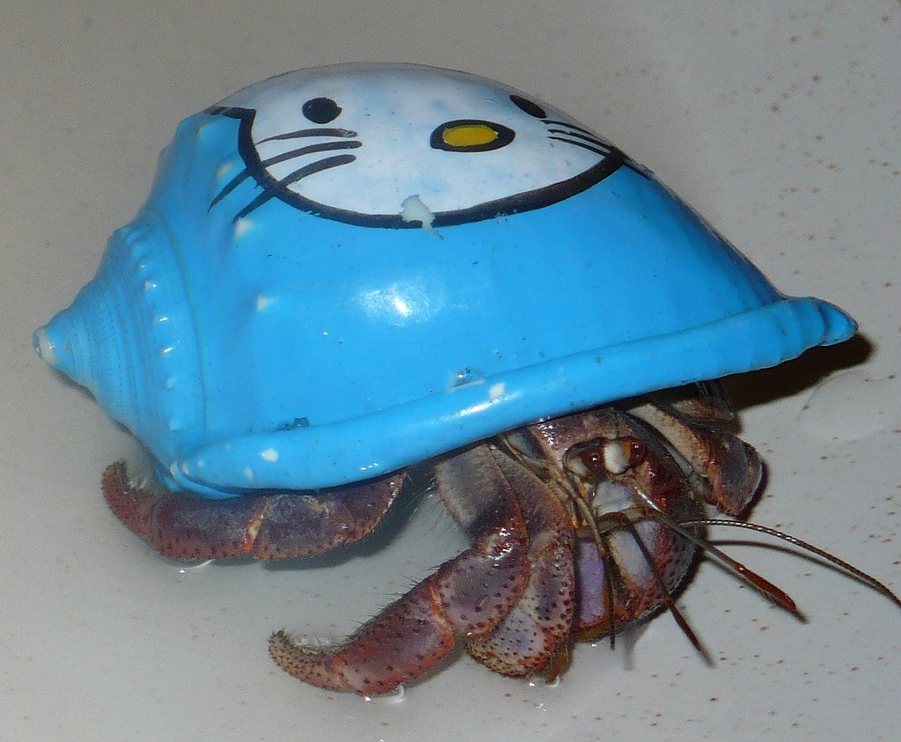

<!--
Creator: Ben Hulan
Market: SF
-->


<!--11:50 WDI4 -->
<!--Actually 1:35 -->
<!--WDI5 11:33 -->
<!--11:40 5 minutes -->

<!--Opening: OK, so we just dove really deeply into objects in JS and Object-Oriented Programming.  Now we're going to pull back and explain this on a more conceptual level.  So without further ado, let's start putting some names to all of those things we talked about earlier.-->

# Strengthening OOP Concepts and JavaScript

## Why is this important?
<!-- framing the "why" in big-picture/real world examples -->
- Understanding OOP concepts gives us an excellent frame of reference for a lot of information that comes later in the course. - OOP concepts are the most common way that developers think about organizing code at a high level.
- OOP concepts help inform the MVC architecture, how frameworks like React are used to create apps, and so much more.
- OOP design patterns give us an opinion about the way we architect our own applications.
- As we prepare for Project 1 browser games, OOP concepts can give us a way to break down complex problems into multiple smaller, simpler steps.
- Simply put, understanding Object Oriented Programming will make us better developers.

## What are the objectives?
<!-- specific/measurable goal for students to achieve -->
*After this workshop, developers will be able to:*

- **Recognize** when objects can help in creating simpler tasks
- **Recognize**, **understand** and **write** prototype functions
- **Refactor** code with OOP concepts such as
    - encapsulation
    - abstraction
    - inheritance

## Where should we be now?
*Before this workshop, developers should already be able to:*

- **Code** working solutions for projects of a complexity similar to the [tic-tac-toe](https://github.com/den-wdi-2/tic-tac-toe) lab.
- **Explain** how to create objects in Javascript using literals and constructors.

<!--Actually 1:40 -->
<!--11:45 5 minutes -->
<!--11:54 WDI4 -->

## What is OOP?
Object Oriented Programming(OOP) is one of the big progamming paradigms. It stretches across languages, 
so you can talk about OOP in JavaScript, in Ruby, or even C++. The primary benefit of OOP is providing a 
common way for developers to talk about breaking down problems. It is a very deep area. At CU Denver,
you can take a [graduate course](https://oneclass.com/#!/schools/university_of_colorado_denver/1489296-csci-5255)
solely on OOP.

The basic idea behind OOP is to create **Abstract Data Types** (**ADTs**). **ADTs** are 
representations of concepts defined in terms that the computer can understand.
An example can be made of the flowers from earlier. What is the essence of a rose to 
JavaScript? .... I don't know but I can try to build an understanding by defining some properties
that JavaScript does understand. 

We can even combine previous ADTs we've created to define new ADTs. If we're trying to define a car 
ADT, and we've already defined a Tire ADT we can use the Tire ADT to help define the Car ADT. We can 
even go back and redefine one object in terms of another later.

So why do we care about ADTs if everything needs to be translated back into 1s and 0s anyway? Well,
humans don't think in 1s and 0s. Giving something a more concrete name makes it much easier to
work with. Using ADTs makes it easy to talk about the same things all day. We don't need to talk
about *flowers* with our project managers and *objects* when writing code. We can change the code
that we write to match the way we talk to humans about what we are trying to do.

Let's define one more term related to ADTs. When we create a specific object or allocate a single
block of memory related to an ADT, we call that an **instance** of an ADT.

<!--Actually 1:44 -->
<!--11:50 10 minutes -->

### Refactoring Part 1

Let's think about some ADTs that might be in the LOTR lab. Another way to put this is, "What are the
objects in the LOTR lab?"

Let's look at what [I came up with](https://github.com/den-materials/dom-manipulation-lotr-lab/blob/oop-refactor/solution-code/app/scripts/fellowship.js).

<!--11:48 WDI5 -->
<!--12:06 WDI4-->
<!--12:00 10 minutes -->

### Encapsulation

Once we've identified some ADTs, our key responsibility is to make sure that someone only needs to 
understand the properties and methods in our ADT to use our ADT. In other words, we should be able to 
write a one-sentence description of any properties and methods in our ADT.

Think about addition. Whoever wrote JavaScript needed to specify at the 1s and 0s level what it means
to add two numbers. I don't need to understand that.
As a user of the JavaScript number ADT, I just need to know the method, ``+`` and 
what number addition means to the number ADT.

Another example. If I write a Car ADT that has the concept of position, I just need to give enough 
information to set and change the position. For example, I could pass an address, or a lat/lng 
combination, or just some grid coordinates. The ADT has responsibility for deciding how to actually 
store and manipulate the position once I've set it.

With these examples in mind, we can define [**encapsulation**](https://en.wikipedia.org/wiki/Encapsulation_(computer_programming)#General_definition) as *the bundling of data with the methods that operate on that data in order to hide the internal values or state of an object*.

<!--CFU: Does this remind you of any other coding paradigm we've discussed so far?  (To me it sounds like an API) -->

<!--1:54 -->

<!--WDI5 11:51 -->
<!--12:10 WDI4 -->
<!--12:10 10 minutes -->

### Inheritance and Polymorphism

JavaScript **inheritance** is different from most languages. In most languages, **instances** are born with a type 
and die with that type. They're like a turtle. Take away the shell and you've taken away the turtle. 
In JavaScript, instances are more like hermit crabs, where the type is just the shell they're carrying
around right now. Also, like hermit crabs, we can keep the structure of our shell, but decorate it with
our own style.




When we make a new Object, we're getting a new copy of the shell, from an existing **prototype**.

If we use the literal notation, we are saying take the ``Object`` shell as my **prototype** and
add some new stuff: that's the ADT of my newly created instance.

Using a constructor is basically a factory for creating similar shells, from the same **prototype**.

<!--Walk through all three of these in the console, using Object.getPrototypeOf()-->

```js 

daisy = {
    color: "white",
    petals: 64,
    smells: false,
    bloom: function(){ console.log("Look at me"); } 
} 

function Flower() {
    this.color = "red";
    this.petals = 32;
    this.smells= true;
 }

var tulip = new Flower(); // Factory for shells
```

Once we start using an object, we start by asking if the object itself has changed or created a property or 
method. (Did the crab change its own shell?) If the object has not changed its property, we ask if the 
property or method is defined in the prototype of the object. (Was the property or method defined on the 
source of the crab's shell?) If we can't find it in that prototype we ask is there another prototype 
of the prototype, and so on. (Did the source of our shell copy their shell from somewhere else?) 
Eventually we'll end up at the ``Object`` prototype which is pretty minimal. If we don't find it there,
 we finally return ``null``.

This ability to go up the prototype chain lets you define hierarchies of ADTs. For example, we can 
define a Vehicle ADT, then we can define a Car ADT that contains all of the Vehicle properties and 
methods, but also contains some properties that are specific to cars, finally we might have a
Lamborghini ADT that contains methods that are specific to Lamborghinis.

<!--Actually 2:18 -->
<!-- 12:20 5 minutes -->

### Challenge

Returning to flowers, let us define some properties and methods:

```js 
daisy = {
    color: "white",
    petals: 64,
    smells: false,
    bloom: function(){ console.log("Look at me"); } 
} 

function Flower() {
    this.color = "red";
    this.petals = 32;
    this.smells= true;
 }

Flower.prototype = { bloom: function(){ console.log("Look at me")}  }; 

var rose = new Flower(); // Factory for shells
```

Where are the following things defined? If it is defined in the object, say the object name. If it's 
defined in the prototype list objectName.prototype. If it is defined in the prototype's prototype write objectName.prototype.prototype, etc. If it's not defined how many prototypes did you need to check?

* rose.bloom? `=> rose.prototype`
* daisy.bloom?
* rose.color?
* daisy.color?
* daisy.watered?
* rose.watered?
* daisy.toString?
* rose.toString?

<!--WDI4 12:24 when turning over to devs -->
<!--WDI4 12:32 -->

<!--Actually 2:39 -->
<!--WDI5 12:20 after describing the prototype chain with Cars-->
<!-- 12:25 5 minutes -->

### Vocab Check

<!--CFU: Catch-phrase -->

We have brought up a lot of new terms in this class.  Pair up, and try to describe these terms
in your own words, without using any of the words in the list:

- ADT
- Instance
- Encapsulation
- Inheritance

<!--WDI5 12:28 -->

<!--1:30 -->

### `Object.create()`

There is one more significant way to create objects in Javascript, and it has some interesting properties in regards to inheritance.  It is called `Object.create()`, and [this link](https://developer.mozilla.org/en-US/docs/Web/JavaScript/Reference/Global_Objects/Object/create) will explain it in more detail.

## Lab

Take your solution from the [tic-tac-toe](https://github.com/den-materials/tic-tac-toe) mini-project.
- Identify some ADTs(objects) that might be present in your solution. 
    - Add the names of the ADTs to an ``adts.txt`` file.
    - Push the change back to Github
- Create a constructor in your Javascript code for each ADT you identified
    - Refactor your code to use the constructor and any methods you defined on your ADT
- If you find a new ADT while doing this, Great!, add it back to the ``adts.txt`` and include those changes in your commit. 

## Additional Resources
- [Object Oriented Analysis and Design with Applications, by Grady Booch and others](http://www.goodreads.com/book/show/424923.Object_Oriented_Analysis_and_Design_with_Applications)
- [Great lecture notes](https://atomicobject.com/resources/oo-programming/introduction-motivation-for-oo)
- [OOP in JS from JavascriptIsSexy](http://javascriptissexy.com/oop-in-javascript-what-you-need-to-know/)
- [Javascript, The Good Parts](http://www.goodreads.com/book/show/2998152-javascript)
- [Practical Object Oriented Design in Ruby, by Sandi Metz](http://www.poodr.com/)

## Licensing
All content is licensed under a CC­BY­NC­SA 4.0 license.
All software code is licensed under GNU GPLv3. For commercial use or alternative licensing, please contact legal@ga.co.
